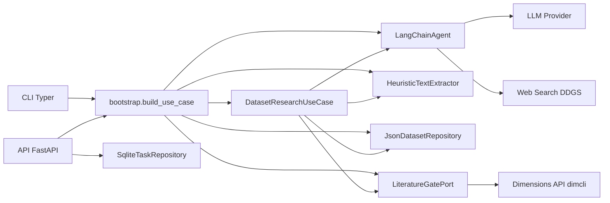
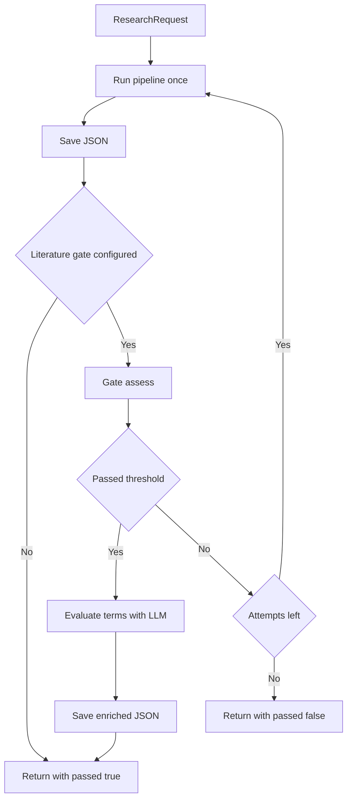

# Documentacao Tecnica Completa - dataset-agent

## 1) Visao geral

O `dataset-agent` e um sistema para **pesquisa de metadados de datasets** com suporte a:

- **CLI** para execucao direta de uma pesquisa por nome de dataset.
- **API HTTP (FastAPI)** para execucao assincrona em tarefas.
- **Validacao de literatura** opcional (gate `dimensions`) para medir relevancia de publicacoes.

Entrada minima:

- Nome do dataset (`dataset_name`).
- Opcionalmente webhook (`webhook_url`) no fluxo de tarefas API.

Saida principal:

- Um JSON canonico (`DatasetRecord`) persistido em disco.
- Metadados de validacao (`literature_validation`, `terms_evaluation`, `publications_total`) quando gate de literatura esta ativo.

---

## 2) Arquitetura e organizacao do codigo

O projeto segue separacao em camadas:

- `src/dataset_agent/domain`: modelos e contratos (ports).
- `src/dataset_agent/application`: caso de uso e prompts de orquestracao.
- `src/dataset_agent/adapters`: implementacoes concretas (LLM, extracao, persistencia, SQLite, literatura).
- `src/dataset_agent/interfaces`: bordas de entrada (CLI e API HTTP).
- `src/dataset_agent/bootstrap.py`: composicao de dependencias.
- `src/dataset_agent/settings.py`: configuracao por ambiente com `pydantic-settings`.

Fluxo de composicao:

1. `Settings` define provider LLM, paths, gate, thresholds, defaults de dominio.
2. `build_use_case()` instancia adapters concretos.
3. `DatasetResearchUseCase` executa pipeline e retorna `(record, path)`.

Diagrama da arquitetura:



---

## 3) Fluxo ponta a ponta de pesquisa

Arquivo central: `src/dataset_agent/application/research.py`.

### 3.1 Pipeline principal (1 ciclo)

O metodo `_run_pipeline_once()` executa 4 passos LLM:

1. **Descricao + home_url** (1 chamada LLM)
   - Prompt `description_and_home_url_prompt`.
   - Parse por secoes `===DESCRIPTION===` e `===HOME_URL===`.
   - Limpeza de descricao via `clean_description`.

2. **URLs + access_type** (1 chamada LLM)
   - Prompt `urls_and_access_prompt`.
   - Extrai `DATA_URL`, `SCHEMA_URL`, `DOCUMENTATION_URL`, `ACCESS_TYPE`.
   - Fallback de URL para `home_url` quando faltar `data_url` ou `documentation_url`.
   - Normalizacao de acesso via `normalize_access_label` (`Open`, `Restricted`, `Unknown`).

3. **Organizacoes / flag_terms** (1 chamada LLM)
   - Prompt `organizations_prompt`.
   - Parse de lista por `HeuristicTextExtractor.extract_list`.
   - Pos-processamento em `process_organizations`:
     - limpeza de ruido de saida LLM,
     - split de padroes `Name (ACR)`,
     - expansao por `ACRONYM_MAP`,
     - deduplicacao/ordenacao.

4. **Aliases / dataset_names** (1 chamada LLM)
   - Prompt `aliases_prompt`.
   - Parse de lista e garantia do nome original.
   - Filtro `_filter_alias_entries`:
     - remove lixo/formato,
     - preserva URLs/DOI,
     - remove anos,
     - normaliza capitalizacao,
     - remove redundancias por substring (`filter_aliases_by_substrings`).

Ao final, monta `DatasetRecord` com `build_record_from_pipeline()` usando defaults de `Settings`.

### 3.2 Persistencia e gate de literatura (com retries)

Em `execute()`:

1. Define `max_attempts` com `literature_max_attempts`.
2. Para cada tentativa:
   - roda pipeline;
   - salva JSON em disco (`JsonDatasetRepository.save`);
   - se nao houver gate, encerra com sucesso;
   - se houver gate, roda `assess(record, sample_size)`.
3. Se `passed=True`:
   - grava `literature_validation` no record;
   - extrai `publications_total`;
   - roda sempre `evaluate_terms_with_llm` e salva em `terms_evaluation`;
   - persiste JSON final novamente.
4. Se todas tentativas falharem:
   - **nao levanta excecao**;
   - retorna resultado final com `literature_validation.passed=False` e `terms_evaluation`.

Observacao importante: `LiteratureGateFailed` existe no codigo, mas na implementacao atual do `use_case.execute()` o comportamento final e de **retorno controlado** com validacao negativa, nao abortando por excecao ao estourar tentativas.

Diagrama do ciclo:



---

## 4) Contratos de dominio e formato de saida

Arquivo: `src/dataset_agent/domain/models.py`.

Modelos principais:

- `ResearchRequest`
  - `dataset_name` (obrigatorio, strip)
  - `webhook_url` (opcional)
  - `sample_size` (1..50, default 10)
- `ValidationRequest`
  - entrada para endpoint `/validate`
- `DatasetRecord`
  - registro canonico final, incluindo:
    - campos centrais de negocio (`main_dataset_name`, `description`, `dataset_names`, `flag_terms`)
    - URLs (`home_url`, `data_url`, `schema_url`, `documentation_url`)
    - parametros de pesquisa (`years_range`, `publication_types`, `filter_us_affiliation`)
    - auditoria (`official_name`, `relationship_type`, `official_name_reasoning`)
    - validacao (`literature_validation`, `terms_evaluation`, `publications_total`)

Enums/objetos auxiliares:

- `AccessType`: `Open`, `Restricted`, `Unknown`.
- `Group`, `YearsRange`, `LiteratureValidation`, `TermsEvaluation`.

Contrato de ports (`src/dataset_agent/domain/ports.py`):

- `AgentPort`: `get_information(prompt)`.
- `TextExtractorPort`: extracao de listas/URLs/secoes.
- `DatasetRepositoryPort`: `save(record) -> Path`.
- `LiteratureGatePort`: `assess(record, sample_size) -> LiteratureGateResult`.
- `TaskRepositoryPort`: CRUD de tarefas.

---

## 5) API HTTP detalhada

Arquivo: `src/dataset_agent/interfaces/api.py`.

### Endpoints

- `POST /tasks`
  - cria tarefa (`pending`) no SQLite.
  - dispara execucao em background.
  - resposta: `{id, status}`.

- `GET /tasks/{task_id}`
  - consulta estado e metadados da tarefa.

- `GET /tasks`
  - lista tarefas (param `limit`, default 50).

- `GET /tasks/{task_id}/result`
  - retorna `DatasetRecord` da tarefa concluida.
  - erros:
    - `404` tarefa inexistente
    - `409` nao concluida
    - `500` path ausente/invalido

- `POST /validate`
  - recebe termos ja definidos (`ValidationRequest`).
  - executa somente gate de literatura + avaliacao de termos.
  - retorna `DatasetRecord` preenchido com resultado de validacao.

- `GET /health`
  - status da API.
  - se provider `ollama`, testa conectividade no `/api/tags`.

### Execucao assincrona de tarefas

Rotina `_run_background_task`:

1. Busca payload no SQLite.
2. Marca `processing`.
3. Executa `use_case.execute()`.
4. Marca `completed` e salva `result_path`.
5. Se houver `webhook_url`, envia POST com JSON final.
6. Em erro inesperado, marca `failed` com `error`.

Repositorio de tarefas: `src/dataset_agent/adapters/tasks_sqlite.py`.

Estado da tarefa (`TaskStatus`):

- `pending`
- `processing`
- `completed`
- `failed`

---

## 6) CLI detalhada

Arquivo: `src/dataset_agent/interfaces/cli.py`.

Comando principal:

```bash
dataset-research run "Nome do Dataset" --webhook https://exemplo/hook
```

Comportamento:

- monta `Settings` + `use_case`;
- executa pesquisa;
- imprime JSON do `DatasetRecord`;
- imprime caminho `Saved: <path>` em stderr;
- saida com codigo:
  - `0` sucesso
  - `1` erro geral
  - `2` reservado para `LiteratureGateFailed` (na pratica atual dificil de ocorrer no fluxo padrao).

---

## 7) Adapters e componentes de infraestrutura

### 7.1 Agente LLM (`adapters/agent_langchain.py`)

- Implementa `AgentPort` usando LangChain tool-calling.
- Providers:
  - `ollama` (`ChatOllama`)
  - `openrouter` (`ChatOpenAI` com `base_url` OpenRouter)
- Ferramentas expostas ao agente:
  - `web_search` via `ddgs`
  - `make_request` via `httpx.get`
- Possui coercao defensiva de argumentos de ferramentas para tolerar saidas LLM inconsistentes.
- Tenta carregar prompt do LangSmith Hub (`hwchase17/openai-tools-agent`) com fallback local.

### 7.2 Extracao heuristica (`adapters/extractor.py`)

- Parse de lista por:
  1) `ast.literal_eval` direto,
  2) fragmento entre `[...]`,
  3) lista por bullets em linhas.
- Extracao de URL por regex.
- Extracao de secoes `===SECTION===`.

### 7.3 Limpeza de texto e ruido LLM

- `adapters/text_processing.py`: limpeza de descricao, normalizacao de acesso, filtro de aliases por substring.
- `adapters/llm_output_cleanup.py`: detecta entradas lixo (artefatos de tool-call, metacomentario, fragmentos JSON, formatos de citacao etc.).

### 7.4 Persistencia JSON (`adapters/storage_json.py`)

- Salva em `output_dir`.
- Nome de arquivo sanitizado: `<dataset_normalizado>_research.json`.

### 7.5 Gate de literatura (`adapters/literature.py`)

Modos:

- `NoOpLiteratureGate`: sempre passa (`indicator=1.0`).
- `DimensionsLiteratureGate`:
  - autentica com `dimcli`;
  - monta query DSL com dataset terms + flag_terms;
  - consulta publicacoes (com `abstract` e `concepts_scores`);
  - validacao principal via LLM (quando agente disponivel):
    - gera `mention_score` e `context_score` (0-10),
    - score final por publicacao = `min(mention, context)`,
    - indicador global = media/10.
  - fallback lexical se agente indisponivel.
  - compara com `literature_threshold`.

Tambem oferece `evaluate_terms_with_llm` para diagnosticar qualidade de `dataset_names` e `flag_terms`.

---

## 8) Configuracao e variaveis de ambiente

Arquivo: `src/dataset_agent/settings.py`.

Prefixo: `DATASET_AGENT_`.

Principais variaveis:

- LLM
  - `LLM_PROVIDER` (`ollama` | `openrouter`)
  - `OLLAMA_MODEL`, `OLLAMA_BASE_URL`
  - `OPENROUTER_API_KEY`, `OPENROUTER_BASE_URL`, `OPENROUTER_MODEL`
- Runtime de agente
  - `AGENT_MAX_ITERATIONS`
  - `AGENT_TIMEOUT_SECONDS`
- Persistencia
  - `OUTPUT_DIR`
  - `TASKS_DB`
- Defaults de dominio
  - `DEFAULT_ENGINE`
  - `DEFAULT_GROUP_NAME`
  - `DEFAULT_YEARS_START`, `DEFAULT_YEARS_END`
  - `DEFAULT_PUBLICATION_TYPES`
  - `DEFAULT_FILTER_US_AFFILIATION`
- Literatura
  - `LITERATURE_GATE` (`noop` | `dimensions`)
  - `LITERATURE_MAX_ATTEMPTS`
  - `LITERATURE_THRESHOLD`
  - `DIMENSIONS_API_KEY`

---

## 9) Execucao local, testes e deploy

## 9.1 Instalacao

```bash
python -m venv .venv
source .venv/bin/activate
pip install -e ".[dev]"
```

## 9.2 Execucao

- CLI: `dataset-research run "Dataset Name"`
- API: `dataset-research-api`
- Alternativa API: `uvicorn dataset_agent.interfaces.api:app --reload`

## 9.3 Testes

Comando:

```bash
pytest
```

Cobertura atual observada em `tests/`:

- modelos de dominio (`test_models.py`);
- extractor (`test_extractor.py`);
- endpoints API com use case mockado (`test_api.py`);
- smoke CLI (`test_cli_smoke.py`);
- testes de utilitarios adicionais (`test_llm_output_cleanup.py`, `test_organizations.py`, `test_text_processing.py`).

## 9.4 Docker / Compose

Arquivos: `Dockerfile`, `docker-compose.yml`.

Pontos principais:

- imagem baseada em `python:3.12-slim-bookworm`;
- instala pacote via `pyproject.toml`;
- expoe porta `8000`;
- persiste dados em `/data` (output e SQLite);
- compose mapeia `./data:/data` e `./src:/app/src` para hot reload;
- define `DATASET_AGENT_OLLAMA_BASE_URL=http://host.docker.internal:11434` no servico API por padrao.

---

## 10) Observabilidade e logs

`src/dataset_agent/logging_setup.py` configura logger `dataset_agent`:

- nivel por `LOG_LEVEL` (default `INFO`);
- saida em `stderr`;
- formato com timestamp, nivel, logger e mensagem;
- funcao idempotente para conviver com reload e workers.

---

## 11) Diferencas entre documentacao conceitual e implementacao atual

Com base em `LOGICA_DO_PROJETO.md` vs codigo atual:

1. O pipeline implementado esta consolidado em **4 chamadas LLM por ciclo**, enquanto o documento conceitual descreve mais passos atomicos.
2. O gate de literatura atual utiliza fortemente avaliacao LLM por publicacao com `abstract + concepts_scores`; o desenho conceitual fala em estrategia lexical + amostragem LLM como triagem.
3. Ao esgotar tentativas de literatura, o caso de uso atual retorna resultado final com `passed=False` (nao interrompe com erro fatal por padrao).

---

## 12) Riscos, limitacoes e pendencias tecnicas

### Dependencias externas

- Forte dependencia de:
  - provider LLM (Ollama/OpenRouter),
  - web search (DDGS),
  - API Dimensions (`dimcli` + chave valida).
- Sem conectividade/chaves, parte do valor do sistema cai para fallback/noop.

### Qualidade de extracao

- Extracao e limpeza sao heuristicas (regex + parse parcial), sujeitas a variacao de resposta LLM.
- Artefatos de tool-call podem escapar dependendo do formato retornado.

### Gate de literatura

- Score depende de julgamento LLM (sensivel a prompt/modelo).
- Query DSL e baseada em termos extraidos; termos fracos geram falso positivo/negativo.

### API assyncrona

- Uso de `BackgroundTasks` da propria API e simples, mas sem fila dedicada/worker externo.
- Escalabilidade e resiliencia sao limitadas para cargas altas.

### Testes

- Existe boa base de testes unitarios e de interface, mas lacunas em:
  - testes de integracao fim a fim com LLM real,
  - testes de regressao do gate `dimensions`,
  - testes de concorrencia/volume na API de tarefas.

---

## 13) Guia rapido de manutencao

1. Ajuste `Settings` para provider/gate e paths.
2. Valide prompts em `application/prompts.py` ao mudar formato esperado de secoes.
3. Mantenha adapters desacoplados dos ports para preservar testabilidade.
4. Ao alterar schema de `DatasetRecord`, atualize:
   - construcao no `use_case`,
   - endpoint `/validate`,
   - testes em `tests/`.
5. Para evoluir escalabilidade da API, avaliar substituicao de `BackgroundTasks` por fila externa.

---

## 14) Inventario de arquivos-chave

- Entrada e composicao
  - `src/dataset_agent/interfaces/cli.py`
  - `src/dataset_agent/interfaces/api.py`
  - `src/dataset_agent/bootstrap.py`
  - `src/dataset_agent/main_api.py`
- Dominio e aplicacao
  - `src/dataset_agent/domain/models.py`
  - `src/dataset_agent/domain/ports.py`
  - `src/dataset_agent/application/research.py`
  - `src/dataset_agent/application/prompts.py`
- Adapters
  - `src/dataset_agent/adapters/agent_langchain.py`
  - `src/dataset_agent/adapters/extractor.py`
  - `src/dataset_agent/adapters/text_processing.py`
  - `src/dataset_agent/adapters/llm_output_cleanup.py`
  - `src/dataset_agent/adapters/organizations.py`
  - `src/dataset_agent/adapters/literature.py`
  - `src/dataset_agent/adapters/storage_json.py`
  - `src/dataset_agent/adapters/tasks_sqlite.py`
- Operacao
  - `README.md`
  - `pyproject.toml`
  - `Dockerfile`
  - `docker-compose.yml`
  - `LOGICA_DO_PROJETO.md`

