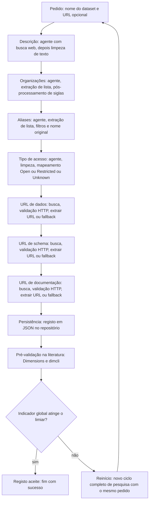
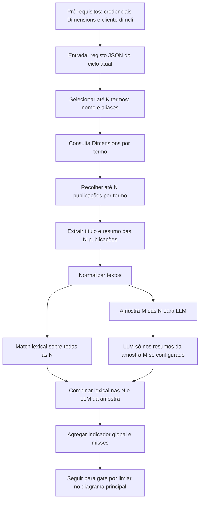

# Lógica do projeto (entidades e fluxos, sem referência a código)

Documento para reimplementar ou evoluir o sistema a partir de conceitos de domínio e regras de negócio.

## Visão geral

O sistema é um **agente de pesquisa de metadados sobre um dataset**: dado um **nome** (entrada única do utilizador; **webhook** opcional no modo API), produz um **registo estruturado** com descrição, nomes alternativos, entidades organizacionais, tipo de acesso e ligações úteis. O “motor” é um **modelo de linguagem** que pode **pesquisar na web** e, nalguns passos, **pedir páginas HTTP** para confirmar que uma URL responde. Depois da persistência, corre uma **pré-validação na literatura** (Dimensions): é **obrigatória**, mas **superficial** — um **filtro grosseiro** (match lexical nas **N** publicações devolvidas, mais **LLM** só numa **amostra M ≤ N**) para decidir se o ciclo de pesquisa merece ser **aceite** ou **repetido** face a um **limiar**; **não** substitui um **fluxo à parte** que valida **publicação a publicação** com o rigor que esse segundo fluxo exige. Caso o limiar não seja atingido, **reinicia-se** o processo de pesquisa desde o pedido (com tentativas máximas).

---

## Entidades principais

### Pedido de pesquisa

- **Nome do dataset** (obrigatório).
- **Webhook** opcional (notificação HTTP ao concluir, sobretudo no modo API assíncrono).

Anos, grupo, motor bibliográfico, tipos de publicação e restantes parâmetros vêm da **configuração de execução**, não do pedido.

### Registo do dataset (resultado)

O resultado do pipeline alimenta um **JSON canónico** usado por fluxos com **Dimensions** (e afins): pesquisa na literatura, filtros por ano, tipo de publicação e *webhook* de conclusão. Mapeamento conceptual dos campos:

| Campo JSON | Papel |
|------------|--------|
| `engine` | Motor bibliográfico alvo (ex.: `"dimensions"`). |
| `group` | Agrupamento lógico (ex.: `{ "name": "Workforce 2" }`) para relatórios ou filas. |
| `main_dataset_name` | Nome principal do dataset (nome canónico / pedido). |
| `home_url` | URL “casa” / referência inicial. |
| `description` | Texto descritivo. |
| `dataset_names` | Nomes alternativos, citações, siglas (equivalente a **aliases**). |
| `flag_terms` | Entidades / afiliações / organizações usadas como sinal na literatura (equivalente a **organizações** e termos de contexto). |
| `exclude_terms` | Termos a excluir em buscas ou pós-filtros. |
| `years_range` | `{ "start_year", "end_year" }` para filtrar publicações. |
| `filter_us_affiliation` | Se a regra de produto filtra por afiliação nos EUA (`true` / `false`). |
| `publication_types` | Tipos aceites na Dimensions (ex.: `["article"]`). |
| `access_type` | `"Open"`, `"Restricted"` ou `"Unknown"` (ou convenção equivalente). |
| `data_url`, `schema_url`, `documentation_url` | URLs derivadas do pipeline de pesquisa. |
| `official_name` | Nome oficial preferido quando identificável. |
| `relationship_type` | Relação entre `main_dataset_name` e `official_name` (ex.: `official_name`). |
| `official_name_reasoning` | Nota curta sobre como `official_name` foi obtido (auditoria). |
| `webhook_url` | URL opcional para notificação quando o fluxo termina (ou etapa assíncrona). |

Campos adicionais (ids de tarefa, tempos, versão do schema) podem existir noutra camada conforme a implementação.

### Exemplo de registo (JSON de referência)

Exemplo concreto alinhado ao schema acima (conteúdo ilustrativo fornecido como referência de produto):

```json
{
  "engine": "dimensions",
  "group": {
    "name": "Workforce 2"
  },
  "main_dataset_name": "Dingel and Neiman Remote Work Feasibility Classification",
  "home_url": "https://github.com/jdingel/DingelNeiman-workathome",
  "description": "The Dingel and Neiman Remote Work Feasibility Classification is a dataset that classifies the feasibility of working from home for all occupations in the U.S. Standard Occupational Classification (SOC) system. Created by economists Jonathan I. Dingel and Brent Neiman at the University of Chicago Booth School of Business, the classification was developed in response to COVID-19 social distancing measures to answer a fundamental question: how many jobs can be performed at home? The methodology uses O*NET survey responses about work context and activities to determine whether each occupation can be performed remotely. Key findings show that 37 percent of U.S. jobs can be performed entirely at home, with significant variation across cities and industries. These remote-feasible jobs typically pay more and account for 46 percent of all U.S. wages. The classification has been applied to 85 other countries, revealing that lower-income economies have fewer jobs that can be done at home. The dataset is publicly available on GitHub and has been widely cited in labor economics and COVID-19 research. Published in the Journal of Public Economics (2020) and as NBER Working Paper 26948.",
  "dataset_names": [
    "Dingel and Neiman Remote Work Feasibility Classification",
    "Dingel-Neiman Work from Home",
    "Work from Home Classification",
    "Remote Work Feasibility",
    "Work at Home Classification",
    "WFH Feasibility",
    "Teleworkability Index",
    "Remote Work Index",
    "Occupation Telework Score"
  ],
  "flag_terms": [
    "BFI",
    "Becker Friedman Institute",
    "Booth School of Business",
    "NBER",
    "National Bureau of Economic Research",
    "UChicago",
    "University of Chicago",
    "University of Chicago Booth School of Business"
  ],
  "exclude_terms": [],
  "years_range": {
    "start_year": 2015,
    "end_year": 2025
  },
  "filter_us_affiliation": false,
  "publication_types": ["article"],
  "access_type": "Unknown",
  "data_url": "https://github.com/jdingel/DingelNeiman-workathome",
  "schema_url": "https://github.com/jdingel/DingelNeiman-workathome",
  "documentation_url": "https://github.com/jdingel/DingelNeiman-workathome",
  "official_name": "Dingel and Neiman Remote Work Feasibility Classification",
  "relationship_type": "official_name",
  "official_name_reasoning": "Could not determine official name from research; using provided name as fallback.",
  "webhook_url": "https://webhook.site/"
}
```

### Tarefa assíncrona (modo serviço)

- Identificador único, estado (pendente / em processamento / concluída / falhou), datas.
- Resultado persistido quando a tarefa termina.

### Configuração de execução

- Provedor e modelo de linguagem.
- Provedor de busca na web.
- Diretório de saída, níveis de registo de eventos, credenciais em variáveis de ambiente quando aplicável.

---

## Papéis e dependências externas

### Agente com ferramentas

- Consome prompts sequenciais.
- Pode invocar **busca web** e **pedidos HTTP** conforme o prompt e o comportamento do modelo.
- Limites habituais: número máximo de “voltas” com ferramentas e tempo máximo por invocação.

### Extrator de listas e URLs a partir de texto

- Interpreta a resposta textual do modelo para obter listas (ex.: formato de lista) ou um URL isolado.
- Usa heurísticas (não garante semântica correta).

### Repositório de ficheiros

- Grava o registo final em **JSON** num diretório, com nome derivado do nome do dataset (normalizado).

### Validação na literatura (Dimensions), pré-filtro

- Após a persistência, consulta indexadores (via **API Dimensions** / **`dimcli`**) e calcula um **indicador grosseiro**; compara com um **limiar**. Se falhar, o orquestrador **reinicia** o ciclo de pesquisa até ao limite de **tentativas**. A **validação fina**, **publicação a publicação**, pertence a **outro fluxo** (não documentado aqui como núcleo deste pipeline).

### Opcional: API HTTP + base relacional leve

- Autenticação por chave.
- Cria tarefa, processa em segundo plano, consulta estado e resultado.
- Armazena cópia resumida do resultado na base.

---

## Lógica central (pipeline de pesquisa)

Tudo é **sequencial**: cada passo usa o **nome do dataset**, a **descrição já obtida** e a **URL opcional** como contexto nos prompts seguintes (ver diagrama abaixo).

### Diagrama do fluxo



Em cada passo o agente pode usar **busca web**; nos três passos de **URL** também se espera **validação HTTP** quando o modelo segue as instruções do prompt. O **modo API** executa este mesmo pipeline dentro de uma tarefa assíncrona e grava o resultado associado ao cliente. Após **Persistência** segue sempre a **pré-validação na literatura**; se o **indicador** ficar **abaixo do limiar**, o fluxo **volta ao pedido** e repete o pipeline (ver secção seguinte). A **validação fina publicação a publicação** é **outro fluxo**, não representado neste diagrama.

1. **Descrição**  
   Pedir ao agente uma descrição curta e informativa, usando busca web. Limpar artefactos comuns de texto (ex.: blocos de raciocínio, ruído).

2. **Organizações**  
   Pedir lista de organizações ligadas ao dataset (criadores, financiadores, etc.), com busca web. Extrair lista do texto. Pós-processar: separar “nome completo” e siglas entre parêntesis, expandir siglas conhecidas por um mapa fixo de acrónimos (orientado sobretudo a contexto institucional dos EUA), deduplicar e ordenar.

3. **Aliases**  
   Pedir nomes alternativos e forma de citação, com foco em publicações e identificadores, usando busca web. Extrair lista do texto. Garantir que o **nome original** do pedido entra na lista se ainda não estiver. Pós-processar: regras de limpeza (anos, capitalização, exclusão de entradas triviais), tratamento distinto para URLs/DOIs, remoção de redundância quando um item é **substring** de outro.

4. **Tipo de acesso**  
   Pedir ao agente classificar acessibilidade/licenças com busca web. Mapear a resposta textual para uma de três etiquetas por **palavras-chave** na resposta (aberto / restrito / desconhecido), após limpeza leve — **não** é uma análise jurídica fiável.

5. **URLs (dados, schema, documentação)**  
   Para cada tipo, pedir uma URL adequada com busca web e instruir a **validar** respostas HTTP quando possível. Extrair um único URL da resposta. Se não houver URL e existir URL inicial no pedido, usar essa como **fallback** genérico.

6. **Persistência**  
   Serializar o registo completo para JSON no repositório de ficheiros. Se o fluxo for via serviço, atualizar tarefa e guardar resultado na base.

7. **Pré-validação na literatura (obrigatória, superficial)**  
   Com o registo persistido, consultar a **Dimensions** (ex.: via **`dimcli`**) e obter um **indicador agregado**: **match lexical** sobre **até N** publicações por termo, mais (se configurado) **LLM** aplicado **só a uma amostra M ≤ N** extraída desse conjunto — **não** uma chamada LLM por cada uma das N. Serve como **triagem**, não como substituto da validação **publicação a publicação** noutro fluxo.

8. **Critério de limiar e repetição**  
   Comparar o indicador com um **limiar** mínimo. **Se** o indicador **não** atingir o limiar, **não** se dá o caso por encerrado: **reinicia-se o processo** desde o **pedido de pesquisa** (novo ciclo completo dos passos **1 a 8** — pesquisa, persistência, validação e gate), reutilizando o mesmo nome e URL opcional salvo que a política de produto permita ajustes. Deve existir um teto de **tentativas máximas** e, ao esgotar, falha controlada (erro explícito ou escalação humana) para evitar ciclo infinito.

---

## Pré-validação na literatura (Dimensions), obrigatória

Etapa **integrada** no fluxo global, de natureza **superficial**: após cada persistência, usa **publicações** indexadas (via **API Dimensions** / **`dimcli`**) para ver se há **apoio grosseiro** aos termos extraídos (**nome**, **aliases**) em título/resumo, e alimenta o **gate por limiar** (aceitar o registo deste ciclo ou **repetir** o pipeline de pesquisa). **Não** se pretende **acurácia total** nesta camada: existe **outro fluxo** que valida **cada publicação** ao detalhe; aqui o objectivo é só **sinal forte o suficiente** para fechar ou relançar a pesquisa de metadados. Isto **não** substitui **testes unitários** sobre extractors ou limpeza de texto.

### Encaixe no sistema

Integrado no **Diagrama do fluxo** da secção «Lógica central»: após **Persistência** segue **Pré-validação na literatura**, depois o **diamante** do **limiar** (**sim** → registo aceite neste pipeline; **não** → **Reinício** até ao pedido inicial). O diagrama seguinte detalha só o interior da pré-validação até à agregação do indicador; o **limiar** e o **reinício** estão no diagrama principal. O **fluxo fino publicação a publicação** é **posterior** e **independente** deste diagrama.

### Fluxo resumido

1. **Pré-requisitos:** credenciais válidas para a API Dimensions (configuração segura, conforme a política da instituição); sem sessão, o eval falha de imediato com mensagem clara.
2. **Entrada:** o registo **JSON** produzido pelo **mesmo** ciclo de execução, logo após a persistência (ficheiro em disco ou objeto em memória, conforme a implementação).
3. **Termos a testar:** escolher até **K** expressões (ex.: nome canónico e parte dos aliases; pode excluir entradas que são só URL se a pesquisa bibliográfica não fizer sentido).
4. **Por cada termo:** formular uma **consulta** no DSL Dimensions; obter até **N** publicações (N fixo, respeitando quotas).
5. **Sobre as N publicações do termo:** extrair **título** e **resumo** (ou o que a API expuser) e **normalizar** os textos; aplicar **match lexical** sobre **todas as N** (triagem barata). Se o **LLM** estiver activo na configuração: formar uma **amostra** de **M** publicações (**M ≤ N**, regra configurável: primeiras, aleatório, etc.) e aplicar **LLM** **apenas** aos **resumos dessa amostra**, com **contexto mínimo** do registo — **sem** LLM sobre cada uma das N. Com LLM desligado, o passo de amostragem para LLM não corre e o indicador baseia-se só no lexical. O rigor **publicação a publicação** fica no **outro fluxo**.
6. **Agregação:** combinar por termo o sinal **lexical nas N** com o resultado **LLM na amostra M** (se existir), produzindo **indicador global** para o gate (ex.: média ou mínimo entre termos — a definir). Trata-se de **triagem**, não de julgamento exaustivo sobre todas as publicações.
7. **Gate por limiar:** comparar o indicador global com o **limiar** configurado. Se **atingir ou ultrapassar** o limiar, o registo do ciclo atual é **aceite** neste pipeline (com relatório para auditoria). Se **não**, dispara-se o **reinício** do **processo completo** desde o pedido (ver passo 8 na lista da Lógica central), até ao máximo de tentativas permitidas. A **confirmação fina** por publicação fica para o **outro fluxo**.
8. **Saída de auditoria:** em qualquer caso, é útil registar relatório legível e/ou JSON com **misses** (trabalhos sem match) para análise e afinação do limiar.

**Iteração interna:** por **cada um dos K termos**, repetem-se consulta Dimensions, recolha das **N** publicações, extração, normalização, **match lexical nas N**, **amostragem M** e **LLM só na amostra**; depois **agregação** por termo e indicador global para o gate.

### Diagrama do fluxo de validação

Desdobra o nó **Pré-validação na literatura** do diagrama principal (entrada = registo já persistido em JSON). Após **normalizar** os textos das **N** publicações: **match lexical** usa **todas as N**; o **LLM** aplica-se **só** a uma **amostra M ≤ N**, não publicação a publicação sobre o conjunto completo. O **limiar**, **aceite / reinício** e volta ao pedido estão no diagrama global; a partir da **agregação**, o controlo passa para esse gate.



### Exemplo de prompt (LLM na amostra de resumos, inglês)

Uma invocação típica cobre **uma** publicação da amostra **M** (podes agrupar várias num único prompt na implementação, desde que o modelo devolva JSON por item). Placeholders: contexto mínimo do registo + título e resumo devolvidos pela Dimensions.

```
You are helping with a coarse metadata-quality gate (not legal proof of citation). Decide if the publication below is plausibly about, uses, cites, or acknowledges the dataset described in the context—or an unambiguous equivalent named in the aliases.

Dataset context:
- Primary name: '{dataset_name}'
- Aliases / citation forms to treat as the same resource: {aliases_json_array}
- One-line description (may be empty): {short_description}

Publication from literature search:
- Title: {publication_title}
- Abstract: {publication_abstract}

Instructions:
1. Base your judgment only on the title and abstract. Do not infer facts that are not stated or strongly implied.
2. Answer "related": true only if there is a clear, specific link to this dataset (or an alias above). Same broad field (e.g. "agriculture", "health") without a concrete tie is NOT enough.
3. If the text is vague or could refer to a different data product, answer "related": false.
4. Output ONLY a single JSON object, no markdown, no extra keys, in this exact shape:
{"related": <true or false>, "confidence": "<high|medium|low>", "reason": "<one short English sentence>"}
```

A agregação pode contar frações de `related: true`, ponderar `confidence`, ou combinar com o *hit rate* lexical nas **N** publicações, conforme a configuração.

### Limitações e leitura da métrica

- **Escopo:** este gate é **propositadamente superficial**; **acurácia total** ou decisão **publicação a publicação** não é obrigação desta camada — isso fica no **fluxo posterior** dedicado.
- **Falsos negativos:** citações podem não bater com aliases (outra redação, sigla, menção indirecta); limiar **alto** demais gera **reinícios** sem melhorar o registo.
- **Cobertura:** nem todo o dataset tem presença forte em Dimensions; repetir o pipeline **não** cria artigos novos — pode ser necessário **rever o limiar**, K/N, ou aceitar falha após o máximo de tentativas.
- **Texto disponível:** muitas vezes só **título + resumo**; ausência de match aqui **não** invalida por si o trabalho no fluxo fino.
- **Operacional:** quotas; **M** e chamadas LLM devem ser dimensionados (só **M** resumos por termo, não **N**). Cada **reinício** multiplica agente, Dimensions e LLM — teto de **tentativas** e limiar em conjunto.
- O indicador é um **gate de triagem** no pipeline de metadados, não prova bibliográfica completa; calibração com *golden* continua útil.

O **como correr** (credenciais, comandos, valores por defeito de limiar e tentativas) pode documentar-se no `README`; este ficheiro define só a **lógica** do fluxo.

---

## Prompts utilizados no projeto

O agente combina um **prompt de sistema / template do agente** (LangChain) com **mensagens de utilizador** construídas em cada passo do caso de uso. Os valores entre aspas simples (ex.: nome do dataset) ou interpolados no texto vêm do pedido (`dataset_name`, `dataset_url`) ou do estado acumulado (`description`, etc.). Quando não há URL, o texto inclui a cadeia literal `None`.

### Agente (sistema): LangChain Hub ou fallback

Por defeito tenta-se carregar o template **`hwchase17/openai-tools-agent`** do LangChain Hub (conteúdo mantido pelo Hub; não está duplicado neste repositório). Se o Hub falhar, usa-se um prompt mínimo:

```
You are a helpful assistant that can use tools to answer the user's question.
```

O utilizador envia `{input}` e o executor mantém o `agent_scratchpad` das chamadas a ferramentas (`web_search`, `make_request`).

### Passo: descrição

```
Research the dataset named '{dataset_name}'. 
        
        If a URL was provided for reference, it is: {dataset_url if dataset_url else 'None'}
        
        I need a concise description (150-200 words) that includes:
        - What the dataset contains
        - Who created it
        - Its purpose and use cases
        - Key features or unique aspects
        
        Use the web_search tool to find information about this dataset.
```

### Passo: organizações

```
Find all organizations related to the dataset '{dataset_name}'.

Dataset description: {description}
If a URL was provided for reference, it is: {dataset_url if dataset_url else 'None'}

Find all organizations associated with this dataset, including:
- Dataset creators
- Publishers
- Funders
- Hosting institutions
- Research collaborators

For each organization:
- Include both full names and acronyms (e.g., "United States Department of Agriculture" and "USDA")
- If you see an acronym, search for its full name and include both
- If you see a combined name with acronym like "United States Department of Agriculture (USDA)", separate them into distinct entries

Use the web_search tool to search for "{dataset_name} dataset organization creator publisher funder".

Return your findings as a Python list of strings like this: ["Organization1", "Organization2", "USDA", "United States Department of Agriculture"]
```

### Passo: aliases

```
Find all aliases, names, acronyms, and identifiers for the dataset '{dataset_name}'.

Dataset description: {description}
If a URL was provided for reference, it is: {dataset_url if dataset_url else 'None'}

For the purpose of this task, aliases refer to how publications' authors cite, acknowledge, and credit the dataset in their publications. Search the web for instructions on how to cite, acknowledge, and credit this dataset to help find the aliases information.

Examples of aliases include:
- Alternative names that appear in academic papers or documentation
- How researchers formally cite the dataset in publications
- Shortened versions or commonly used abbreviations
- DOIs, accession numbers, URLs, or other formal identifiers

Specifically consider these common patterns:
- Adjective form of the main noun (e.g., "National" instead of "Nation")
- Organization name + key terms 
- Abbreviations of key terms
- Re-ordering of terms
- With and without "of" or other connecting words
- Common shorthand variations used by researchers

IMPORTANT: 
1. Use the web_search tool to find information about how this dataset is cited and referenced.
2. Include the original dataset name as one of the aliases.
3. Be comprehensive and thorough; find ALL possible variations.

Return your answer as a Python list of strings. For example: ["Name 1", "Name 2", "Acronym", "http://example.com/identifier"]
```

### Passo: tipo de acesso

```
Determine if the dataset '{dataset_name}' is freely accessible (Open), requires registration or payment (Restricted), or if this information is unclear (Unknown).

Dataset description: {description}
If a URL was provided for reference, it is: {dataset_url if dataset_url else 'None'}

Research the dataset's accessibility and licensing. Consider:
- Can anyone download the data without login or payment?
- Is registration, approval, or payment required?
- Are there usage restrictions like non-commercial only?

Search for policies, access information, download pages, or API documentation.

After research, simply respond with one of these three words:
Open - If the dataset is freely accessible without any login or payment
Restricted - If the dataset requires registration, approval, or payment
Unknown - If you can't determine the access type

Use the web_search tool to search for "{dataset_name} dataset access download availability"
```

### Passo: URL (dados, schema ou documentação)

O mesmo texto base; variam `search_suffix` e `type_description`:

| `url_type`   | `search_suffix` | `type_description` |
|-------------|-----------------|---------------------|
| `data` | `dataset download link data access` | `for downloading the dataset's data` |
| `schema` | `dataset schema data dictionary field definitions metadata` | `for the dataset's data dictionary, schema, or field definitions` |
| `documentation` | `dataset documentation user guide technical manual help` | `for documentation, user guides, or technical manuals` |

```
Find a valid URL {type_description} for the dataset '{dataset_name}'.

Dataset description: {description}
If a URL was provided for reference, it is: {dataset_url if dataset_url else 'None'}

First, use the web_search tool to search for "{dataset_name} {search_suffix}".
Then, validate any URL you find using the make_request tool to ensure it returns a 200 status.

If you find multiple URLs, choose the most official and comprehensive one.
If no perfect URL is found, return the closest valid URL that comes from an official source.
DO NOT return "Not found" or an empty response. Return the best URL you can find, even if it's just a landing page.

Return ONLY the URL with no additional text or explanation.
```

---

## Lógica do modo linha de comandos

- Ler argumentos e opcionalmente ficheiro de ambiente.
- Construir configuração (logs, caminhos, provedores).
- Executar o pipeline único acima (incluindo, quando implementado, pré-validação e gate).
- Emitir o registo (ex.: impressão do JSON) e código de saída conforme sucesso ou falha.

---

## Lógica do modo API (resumo)

- Criar tarefa (corpo mínimo: nome do dataset; webhook opcional) e devolver aceitação imediata.
- Em trabalho em segundo plano: marcar processamento, executar o **mesmo** pipeline de pesquisa (e pré-validação quando existir), gravar resultado e marcar conclusão, ou marcar falha em caso de exceção.
- Endpoints para consultar estado, obter resultado quando concluído e listar tarefas.

---

## O que o sistema **não** faz (lógica de “validação”)

- Não verifica aliases ou organizações contra um **catálogo de verdade**.
- Não reprova nem pontua itens devolvidos pelo modelo; só **parse**, **heurísticas** e **regras de limpeza** (e, na pré-validação literária, indicador agregado para gate).
- A validação HTTP aplica-se sobretudo ao fluxo de **URLs** pedidas nos passos finais, não a cada alias.
- A pré-validação Dimensions **não** substitui o fluxo fino **publicação a publicação**.

---

## Princípios de desenho replicáveis

- **Um caso de uso** orquestra o pipeline; **interfaces** isolam agente, extração, armazenamento e (futuro) pré-validação na literatura.
- **Injeção de dependências** na montagem: escolher implementações concretas (modelo local vs serviço na cloud, busca A vs B, só ficheiros vs ficheiros + API).
- **Separação** entre domínio (o que é um dataset e o que se pede) e infraestrutura (LLM, HTTP, ficheiros, base, Dimensions).
