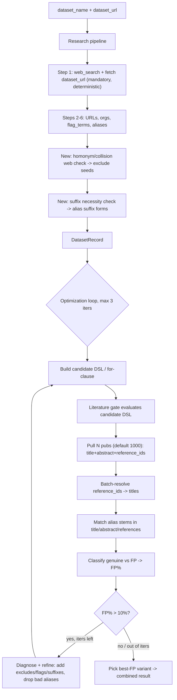

# Unified dataset pipeline redesign

## Target flow

## 1. Step 1: mandatory web search + dataset-URL fetch
- In `_run_pipeline_once` Step 1 ([research.py](src/dataset_agent/application/research.py)), before the LLM call, deterministically call `web_search(...)` and, when `dataset_url` is set, `make_request(dataset_url)` from [tools.py](src/dataset_agent/adapters/tools.py). Inject both results into the prompt as evidence (do not rely on the model deciding to call tools, since `get_information` returns early on `end_turn`).
- Update `description_and_home_url_prompt` in [prompts.py](src/dataset_agent/application/prompts.py) to accept `search_results` and `fetched_page` context blocks and instruct the model to base the description/home_url on them.

## 2. New research step: homonym / collision check
- After aliases are finalized (Step 6), run web disambiguation on the top aliases by reusing `web_search_alias_meanings` from [fp_analysis.py](src/dataset_agent/adapters/fp_analysis.py).
- Persist collision domains and seed `exclude_terms` on the record. Add an `alias_collisions` field to `DatasetRecord` in [models.py](src/dataset_agent/domain/models.py). Bound by a new `research_collision_max_aliases` setting.

## 3. New research step: suffix necessity check
- Inject `DimensionsDslPort` into `DatasetResearchUseCase` (optional) and add a step that calls `check_suffix_necessity` ([query_heuristics.py](src/dataset_agent/adapters/query_heuristics.py)) for bounded risky/short aliases, promoting suffixed forms (e.g. `survey`/`data`/`dataset`). Falls back to an LLM suggestion when no Dimensions key. Record chosen suffix forms on the record.

## 4. Literature gate -> candidate-DSL evaluator
- Refactor `DimensionsLiteratureGate.assess` ([literature.py](src/dataset_agent/adapters/literature.py)) into an evaluator that takes a candidate `for_clause`/DSL and:
  - pulls up to N pubs (default 1000) via `fetch_top_n` ([dimensions_dsl.py](src/dataset_agent/adapters/dimensions_dsl.py)) with fields `basics+title+abstract+reference_ids+times_cited`.
  - batch-resolves reference_ids with a new helper `fetch_reference_titles(dsl_port, ids, batch_size<=512)` using `search publications where id in [...] return publications[id+title]`; dedupe ids across the corpus and cache across iterations. Optimization: only resolve references for pubs that did NOT already match in title/abstract.
  - builds alias stems (light custom stemmer: lowercase, fold punctuation, strip common plural/suffix) and matches in title/abstract/reference-titles.
  - classifies matched pubs genuine vs FP via `classify_alias_mention` (sampled/capped), returning `fp_rate_pct`, genuine count, and per-alias/domain FP diagnostics.
- Add reference-resolution caps to [settings.py](src/dataset_agent/settings.py): enable flag, max unique reference ids, batch size.

## 5. Rewrite optimization loop (FP>10%, <=3 iterations)
- In [query_optimization.py](src/dataset_agent/application/query_optimization.py): keep Phase 1 alias counting/risk, then replace the proxy-FP Phase 3 with the iterative loop:
  1. build candidate DSL (`build_for_clause` V4 with safe/risky/flags/excludes/suffixes).
  2. evaluate via the new gate -> `fp_rate_pct`.
  3. if `fp_rate_pct > optimize_fp_threshold_pct` (default 10) and iterations remain: refine using diagnostics — add exclude terms (`derive_exclude_terms_from_fps`), add flag_terms (hybrid AND), promote suffixes, and drop aliases whose matches are mostly FP.
  4. loop up to `optimize_max_iterations` (default 3); return the variant with the lowest FP rate (tie-break by expected_count).
- New settings: `optimize_fp_threshold_pct=10.0`, `optimize_max_iterations=3`, gate pull size default 1000 (reuse `fp_sample_size`).

## 6. Unify entry points (unify_run)
- Add an orchestrator (e.g. `run_full_pipeline`) that runs research -> optimization+gate and returns a combined result. Attach `query_optimization: QueryOptimizationRecord | None` to `DatasetRecord` (or a new combined response model) in [models.py](src/dataset_agent/domain/models.py).
- Wire CLI `run` ([cli.py](src/dataset_agent/interfaces/cli.py)) and `POST /tasks` + `/tasks/{id}/result` ([api.py](src/dataset_agent/interfaces/api.py)) to the orchestrator; keep `/optimize` as an internal stage / thin wrapper. Default `literature_gate` to `dimensions` and precheck for the Dimensions API key (clear error if missing).
- Update [bootstrap.py](src/dataset_agent/bootstrap.py) to inject the shared `DimensionsDslPort` into research and wire the orchestrator.

## 7. Tests & docs
- Extend tests in `tests/` (research multilingual, query heuristics/optimization, literature dimensions) for: mandatory Step-1 tooling, collision step, suffix step, reference batch resolution, FP>10% iterate-to-3 loop, and best-FP selection.
- Update README / project docs to describe the single mandatory pipeline.

## Open cost note
Resolving reference_ids for 1000 pubs is expensive under the 2.1s Dimensions throttle. Mitigations baked in: resolve references only for title/abstract non-matches, dedupe + cache ids across iterations, batch up to 512 ids/query, and a hard cap on unique ids resolved per run.